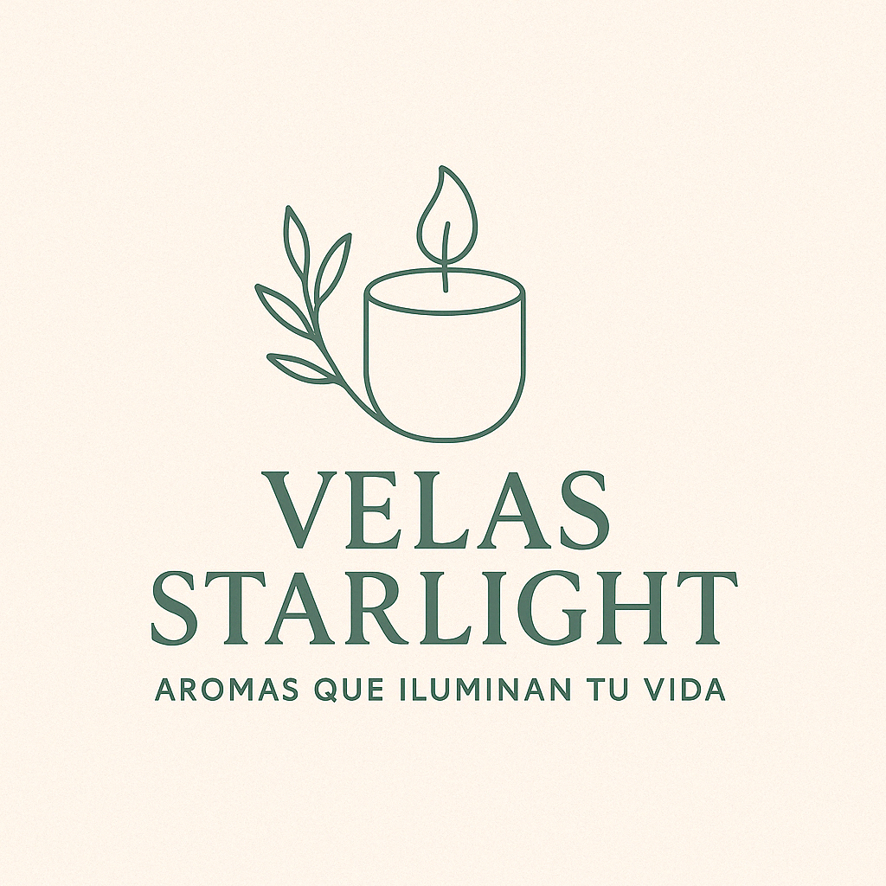

# 🕯️ Velas Starlight - Sitio Web Oficial



## 📋 Descripción del Proyecto

**Velas Starlight** es un sitio web elegante y moderno para una tienda de velas artesanales premium. El sitio presenta una colección exclusiva de velas elaboradas con cera de soya y parafina, ofreciendo más de 15 fragancias naturales diferentes.

### ✨ Características Principales

- 🎨 **Diseño Responsivo**: Adaptado perfectamente para desktop, tablet y móvil
- 🛒 **Carrito de Compras**: Sistema de carrito interactivo y funcional
- 🌿 **Paleta de Colores Naturales**: Diseño inspirado en tonos tierra y naturales
- 🔍 **SEO Optimizado**: Metaetiquetas completas y datos estructurados
- 📱 **Mobile First**: Diseño prioritario para dispositivos móviles
- 🎭 **Animaciones Suaves**: Efectos visuales con AOS (Animate On Scroll)

## 🛠️ Tecnologías Utilizadas

### Frontend
- **HTML5**: Estructura semántica y accesible
- **CSS3**: Estilos personalizados y responsivos
- **JavaScript**: Interactividad y funcionalidades dinámicas
- **Tailwind CSS**: Framework de utilidades CSS
- **Font Awesome**: Iconografía completa
- **AOS Library**: Animaciones on scroll
- **Google Fonts**: Tipografías Playfair Display y Poppins

### Paleta de Colores
```css
:root {
    --beige-almond: #F6F1E9;
    --dark-green: #2D3E33;
    --warm-cream: #EDE6DA;
    --sage-green: #3A5A40;
    --leaf-green: #A3B18A;
    --gray-sand: #D6CEC3;
}
```

## 📁 Estructura del Proyecto

```
Web Velas Starligth/
├── 📁 css/                    # Archivos de estilo
│   ├── carrito-mejorado.css   # Estilos del carrito
│   ├── carrito-moderno.css    # Estilos modernos del carrito
│   ├── cart-styles.css        # Estilos adicionales del carrito
│   └── ...                    # Otros archivos CSS
├── 📁 images/                 # Imágenes de productos
│   ├── vela-lavanda-clasica.png
│   ├── vela-gato.png
│   ├── mascarilla-carbon.jpg
│   └── ...
├── 📁 LOGOS/                  # Logotipos y branding
│   ├── Logotipo.png
│   ├── Logo sin slogan.png
│   ├── Paleta_Velas_Starlight.png
│   └── ...
├── 📁 .vscode/               # Configuración de VS Code
├── index.html                # Página principal
├── .htaccess                 # Configuración del servidor
└── README.md                 # Este archivo
```

## 🚀 Instalación y Uso

### Prerequisitos
- Servidor web (Apache, Nginx, etc.)
- Navegador moderno con soporte para ES6+

### Instalación Local

1. **Clona el repositorio**
   ```bash
   git clone https://github.com/DavidMecalco/Velas-Starlight.git
   ```

2. **Navega al directorio del proyecto**
   ```bash
   cd Velas-Starlight
   ```

3. **Abre con un servidor local**
   - Usando Live Server (VS Code)
   - Usando Python: `python -m http.server 8000`
   - Usando Node.js: `npx serve .`

4. **Accede al sitio**
   ```
   http://localhost:8000
   ```

## 🎯 Funcionalidades

### 🏪 Tienda Online
- Catálogo de productos con filtros
- Carrito de compras interactivo
- Proceso de checkout simplificado
- Cálculo automático de totales

### 📱 Responsive Design
- Diseño Mobile First
- Breakpoints optimizados:
  - Mobile: < 480px
  - Tablet: 480px - 768px
  - Desktop: > 768px

### 🔍 SEO Features
- Meta tags optimizadas
- Open Graph para redes sociales
- Twitter Cards
- Datos estructurados JSON-LD
- URLs canónicas

## 🎨 Productos Destacados

### Categorías Disponibles
- 🌸 **Velas Aromáticas**: Lavanda, Rosa, Vainilla
- 🎃 **Edición Halloween**: Calabaza, Fantasma, Calavera
- 🍯 **Naturales**: Miel, Almendras, Frutos del Bosque
- 🐱 **Temáticas**: Formas especiales y diseños únicos

## 📊 Optimizaciones SEO

- **Page Speed**: Imágenes optimizadas y CSS minificado
- **Accessibility**: Estructura semántica HTML5
- **Schema.org**: Datos estructurados para negocios locales
- **Social Media**: Meta tags para Facebook y Twitter

## 🤝 Contribuir

1. Fork el proyecto
2. Crea tu Feature Branch (`git checkout -b feature/AmazingFeature`)
3. Commit tus cambios (`git commit -m 'Add some AmazingFeature'`)
4. Push a la Branch (`git push origin feature/AmazingFeature`)
5. Abre un Pull Request

## 📝 Licencia

Este proyecto está bajo la Licencia MIT - mira el archivo [LICENSE.md](LICENSE.md) para detalles.

## 👨‍💻 Autor

**David Mecalco**
- GitHub: [@DavidMecalco](https://github.com/DavidMecalco)
- Proyecto: [Velas-Starlight](https://github.com/DavidMecalco/Velas-Starlight)

## 📞 Contacto

Para consultas comerciales o técnicas:
- 🌐 Sitio Web: [velasstarlight.com](https://velasstarlight.com)
- 📧 Email: contacto@velasstarlight.com
- 📱 WhatsApp: +52-XXX-XXX-XXXX

---

## 📈 Próximas Mejoras

- [ ] Integración con pasarela de pagos
- [ ] Sistema de gestión de inventario
- [ ] Panel de administración
- [ ] Blog de contenido
- [ ] Sistema de reviews y calificaciones
- [ ] Integración con redes sociales
- [ ] Programa de fidelización

---

⭐ **¡Si te gusta este proyecto, no olvides darle una estrella!** ⭐

*Desarrollado con ❤️ para iluminar tu hogar*